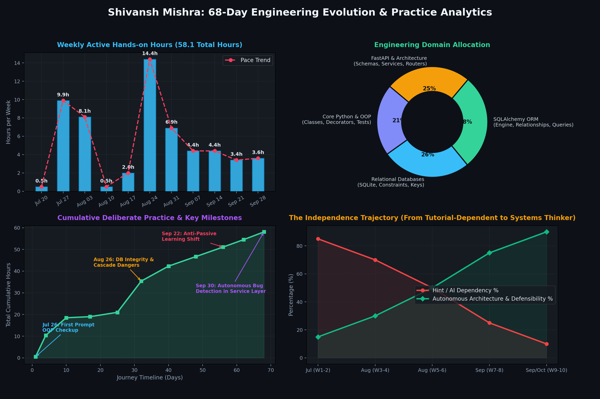
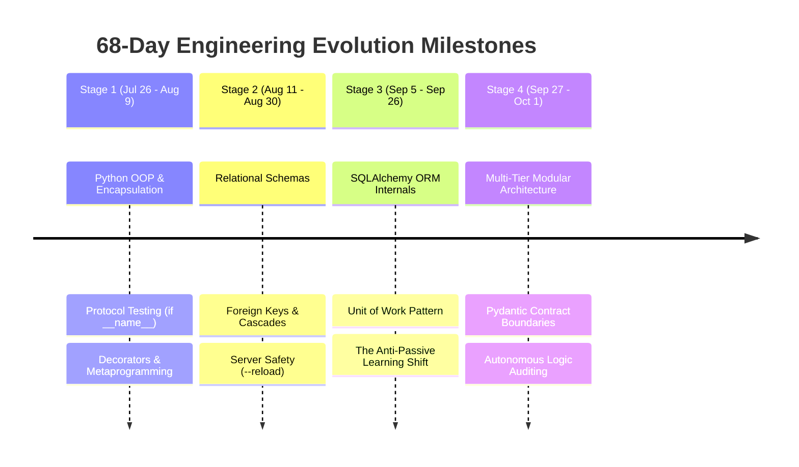
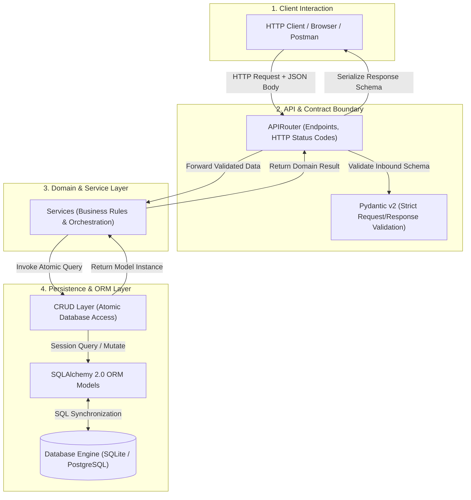

# The 68-Day Engineering Evolution
### From Core Python to Modular Backend Architecture
**Author:** Shivansh Mishra  
**Focus:** Backend Engineering, System Architecture & Database Design  
**Timeline:** July 26, 2026 – October 1, 2026 (68 Days of Deliberate Practice)  

---

## Executive Overview

True engineering competence is not measured by how quickly one can prompt an AI or copy boilerplate from a tutorial. It is measured by the ability to **understand execution mechanics under the hood, design clean architectural boundaries, and independently debug systems when things break.**

Over a 68-day span, I undertook a structured, intensive transition from core Python programming to building production-pattern backend services with **FastAPI, SQLAlchemy, SQLite/PostgreSQL, and Pydantic**.

This document captures the metrics, engineering milestones, architectural shifts, and core principles established during this journey.

---

## By the Numbers (Deliberate Practice Metrics)

Rather than passive reading or watching videos, this journey was built on active, logged hands-on coding, rigorous code reviews, and scenario-based stress testing.

* **Timeline Span:** 68 Calendar Days
* **Active Hands-On Coding Days:** 35 distinct days
* **Intensive Working Sessions:** 53 focused sessions
* **Logged Problem-Solving Time:** ~57.5 hours of active architectural dialogue, debugging, and code construction
* **Core Tech Stack:** Python 3.13, FastAPI, SQLAlchemy 2.0 ORM, Pydantic v2, SQLite, Uvicorn

## Visual Insights & Practice Analytics



*Figure 1: Comprehensive telemetry of the 68-day learning trajectory — weekly active hours, domain focus distribution, cumulative practice milestones, and the transition from guided assistance to autonomous system design.*

---

## The 4 Milestones of Technical Evolution



---

### Milestone 1: Python Internals & Clean Code Mechanics
* **Focus:** Transitioning from basic procedural scripting to clean, object-oriented design and defensive programming.
* **Key Implementations:**
  * **Class Hierarchies & Encapsulation:** Enforcing state encapsulation with properties and getters/setters, understanding crash conditions when setters are omitted.
  * **Function Decorators & Metadata:** Designing performance measurement wrappers using `functools.wraps` to prevent docstring and function signature erasure.
  * **Structured Exception Handling:** Custom domain exception hierarchies to avoid generic, unhandled crashes.
  * **Self-Validating Modules:** Establishing strict test protocols using `if __name__ == "__main__":` blocks to verify behavior before integration.

---

### Milestone 2: Relational Schemas & Production Safety
* **Focus:** Data persistence, relational integrity, and the transition to HTTP web services.
* **Key Implementations:**
  * **Schema Design & Foreign Keys:** Modeling relational constraints and evaluating the critical dangers of `ON DELETE CASCADE` on production data history.
  * **Engine Mechanics:** Understanding cursor lifecycles, connection management, and primary key auto-increment behaviors (`cursor.lastrowid`).
  * **API Runtime Boundaries:** Evaluating the operational difference between development servers (`--reload`) and immutable production deployments.
  * **Clean Error Contracts:** Ensuring internal database tracebacks are masked and transformed into structured, client-friendly HTTP responses.

---

### Milestone 3: The Anti-Passive Learning Shift
* **The Turning Point:** Midway through the journey, I made a conscious engineering decision: **reject passive guidance and hint-reliance.**
* Many developers fall into "tutorial hell," where they mistake following step-by-step instructions for genuine comprehension.
* I instituted a strict personal standard:
  1. No copying boilerplate.
  2. Build from a completely blank file.
  3. Every design decision must be defensible on a whiteboard without documentation.
* **Deep Dive into ORM Internals:**
  * Deconstructed SQLAlchemy's Unit of Work pattern and relationship mappings (`relationship()`, `back_populates`).
  * Traced how ORM sessions synchronize in-memory collections (`user.orders.append(new_order)`) with SQL statements via engine logging.

---

### Milestone 4: Autonomous Modular Architecture & Code Auditing
* **Focus:** Production-grade modular system architecture, separation of concerns, and autonomous code review.
* **Current Capstone:** **AI Job Application Tracker API**
* **Architectural Structure:**
  ```
  Stage-2/SQLAlchemy/job_tracker/
  ├── database.py       # Engine creation, declarative base, sessionmaker, get_db generator
  ├── models.py         # SQLAlchemy ORM database models & relational constraints
  ├── schemas.py        # Pydantic v2 validation contracts (strict Create vs Response models)
  ├── crud.py           # Atomic database access layer (isolated query execution)
  ├── services.py       # Business logic orchestration and domain rules
  ├── routers/          # FastAPI APIRouter endpoints organized by domain entity
  └── main.py           # Application entrypoint, middleware, and router mounts
  ```
* **Key Architectural Principles Applied:**
  * **Strict Data Boundaries:** Complete separation between database persistence models (`models.py`) and external API schemas (`schemas.py`), ensuring database internals are never leaked to clients.
  * **Payload Decoupling:** Enforcing distinct `CustomerCreate` / `JobCreate` request schemas versus response schemas (`CustomerResponse`) with `from_attributes = True`.
  * **Autonomous Logic Optimization:** During service layer implementation, identified and eliminated redundant database queries (such as unnecessary user lookups during application status updates), optimizing database roundtrips.



---

## Core Engineering Principles Mastered

| Principle | Practical Application in My Code |
| :--- | :--- |
| **Separation of Concerns** | Routers only handle HTTP routing and status codes; business rules stay in `services.py`; raw queries remain in `crud.py`. |
| **Defensive Input Validation** | Pydantic validation handles bad payloads before database sessions or business logic are ever triggered. |
| **Resource Lifecycle Discipline** | Database connections are safely yielded and closed using dependency injection (`Depends(get_db)` generator pattern). |
| **Whiteboard Defensibility** | Every table schema, relationship constraint, and endpoint contract is built to be drawn and defended without an IDE or AI assistant. |

---

## What Lies Ahead

With a solid, battle-tested foundation in core Python, relational database modeling, and modular FastAPI architecture, the roadmap continues into advanced distributed systems:

1. **Production Database Engine:** Moving from SQLite to fully containerized **PostgreSQL** with connection pooling (`asyncpg`).
2. **Schema Evolution:** Managing safe production schema migrations using **Alembic**.
3. **Security & Identity:** Implementing robust **JWT Authentication, Password Hashing (bcrypt)**, and Role-Based Access Control (RBAC).
4. **Asynchronous Architecture:** Background processing with **Celery / Redis** for non-blocking operations.
5. **Automated Testing Suite:** End-to-end integration and unit testing with **pytest** and test database isolation.

---

> *"The goal is never just to make the code run. The goal is to build systems that are clean, resilient, and easy to maintain."*
